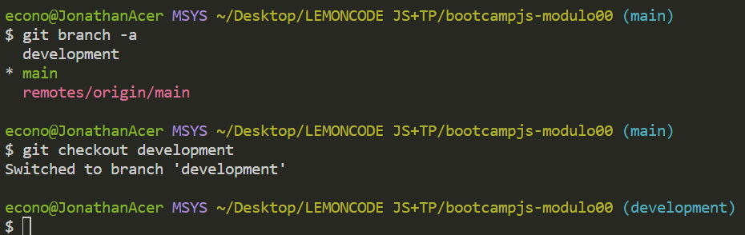
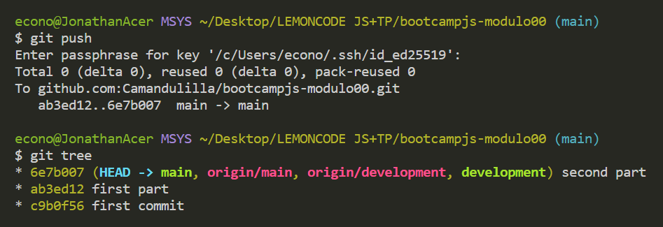

# Laboratorio Modulo 00

1. Crear un repositorio en local.
2. Subir el repositorio a GitHub
3. Hacer un commit y un push

4. Crear una rama.

5. Hacer un merge

-----------------------------------------------------------
FIN DEL MODULO
